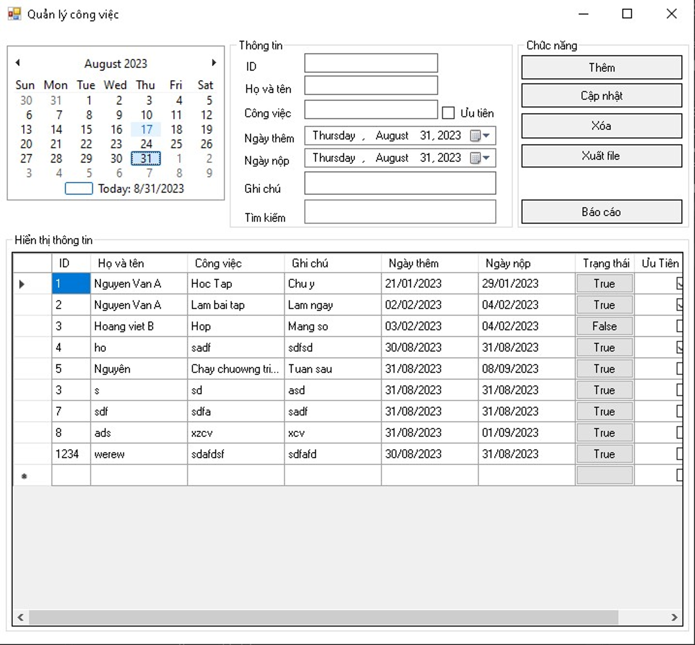

# Quản Lý Công Việc

## Giới Thiệu
Dự án "Quản Lý Công Việc" là một ứng dụng desktop cho phép người dùng quản lý và theo dõi các công việc hàng ngày một cách hiệu quả. Ứng dụng cung cấp giao diện người dùng thân thiện với các chức năng như thêm, sửa, xóa công việc, cũng như báo cáo tình trạng công việc.

## Tính Năng
- **Xem Lịch**: Hiển thị lịch tháng hiện tại và cho phép người dùng chọn ngày.
- **Danh Sách Công Việc**: Hiển thị danh sách công việc với các thông tin chi tiết như ID, tên công việc, ghi chú, ngày bắt đầu, ngày kết thúc, trạng thái và độ ưu tiên.
- **Tìm Kiếm**: Cho phép người dùng tìm kiếm công việc theo tên.
- **Cập Nhật và Lưu Trữ**: Cập nhật thông tin công việc và lưu lại thay đổi.
- **Báo Cáo**: Xuất báo cáo công việc theo yêu cầu.

## Cài Đặt
1. **Yêu Cầu Hệ Thống**:
   - Hệ điều hành: Windows 10 hoặc mới hơn
   - .NET Framework 4.7.2 hoặc mới hơn

2. **Cách Cài Đặt**:
   - Tải xuống mã nguồn từ [GitHub Repository](https://github.com/Github-303/QLCVCIT2).
   - Mở dự án trong Visual Studio.
   - Xây dựng dự án và chạy ứng dụng.

## Hướng Dẫn Sử Dụng
1. **Khởi Động Ứng Dụng**: Mở ứng dụng và chọn tháng trong lịch.
2. **Thêm Công Việc**: Nhấn nút "Thêm" và điền thông tin công việc cần thêm.
3. **Sửa và Xóa Công Việc**: Chọn công việc trong danh sách và sử dụng nút "Cập Nhật" hoặc "Xóa".
4. **Tìm Kiếm Công Việc**: Nhập tên công việc vào ô tìm kiếm và nhấn "Tìm Kiếm".
5. **Xuất Báo Cáo**: Nhấn nút "Xuất báo cáo" để tạo báo cáo công việc.

## Công Nghệ Sử Dụng
- C# 
- Windows Forms
- SQL Server
